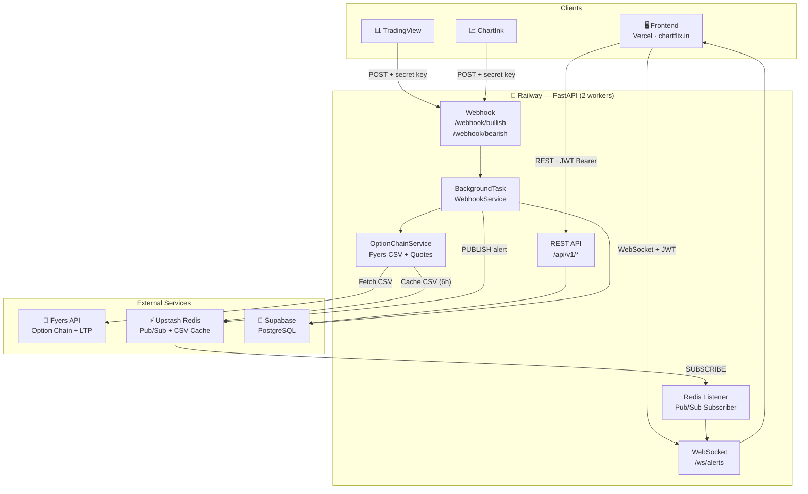
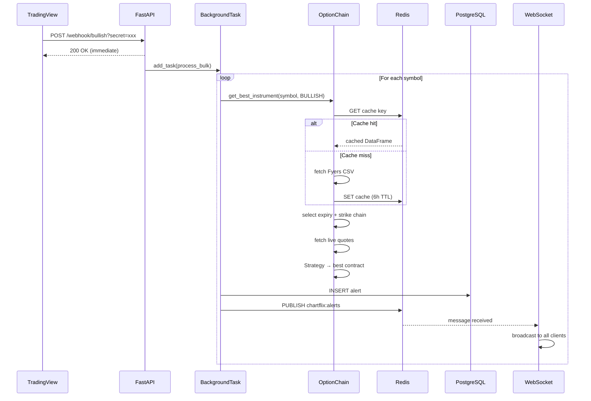
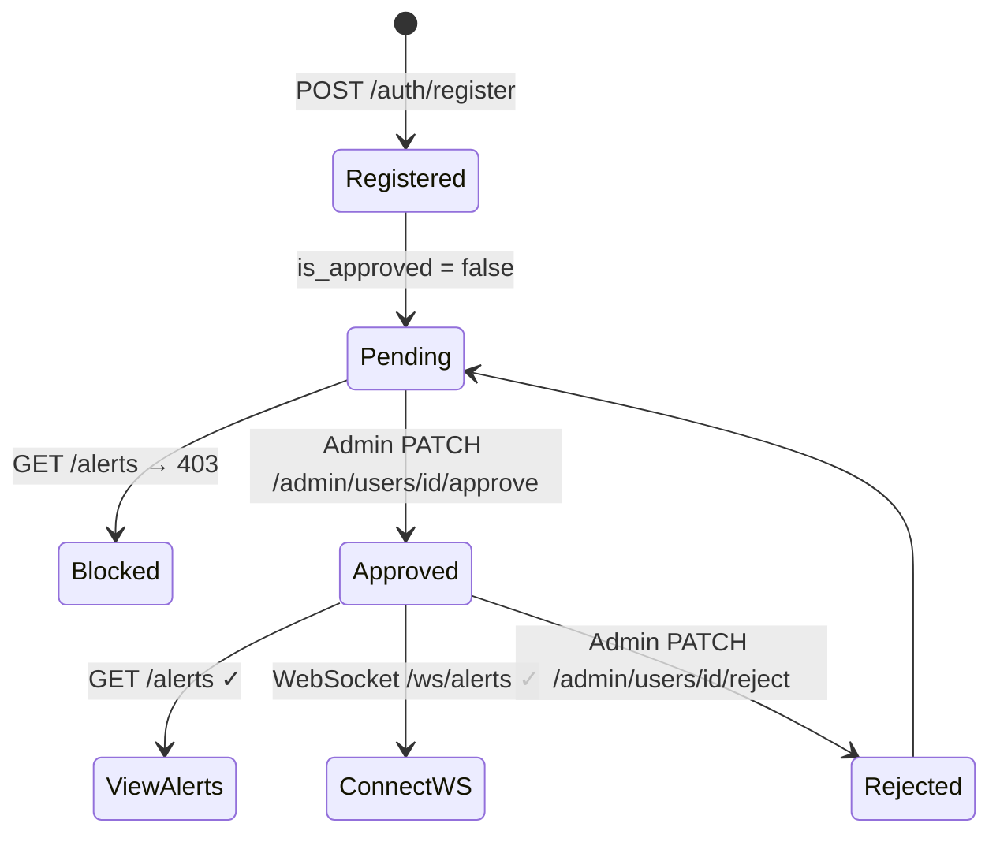
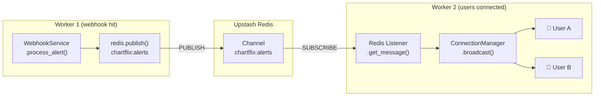
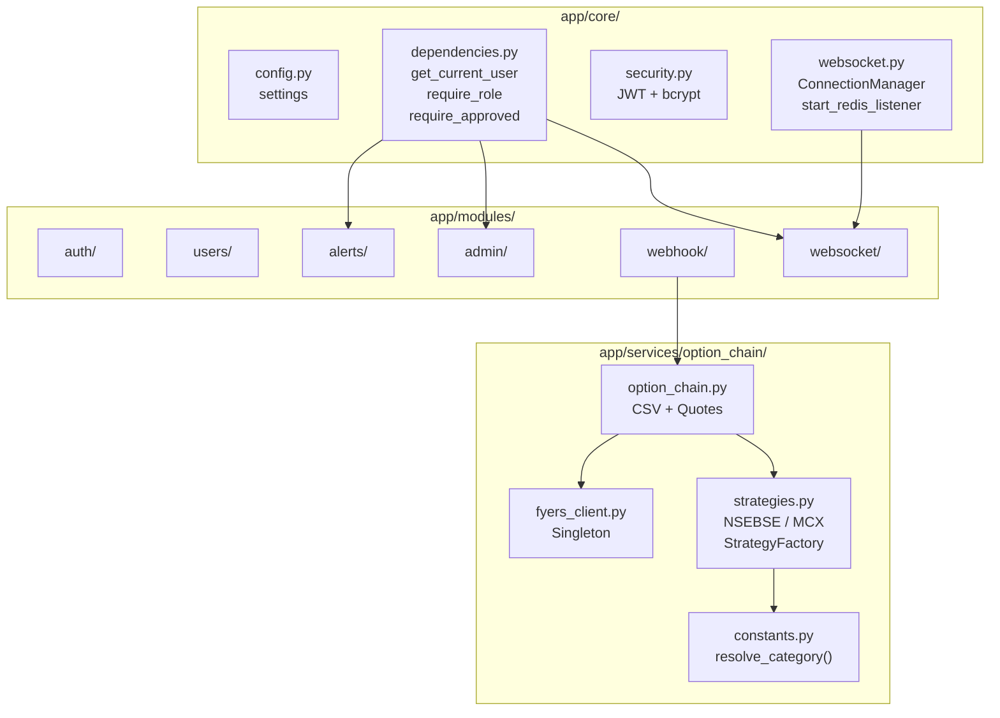

# Chartflix — Architecture Diagram

## System Overview

```mermaid
graph TB
    subgraph Clients
        FE["🖥️ Frontend\nVercel · chartflix.in"]
        TV["📊 TradingView"]
        CI["📈 ChartInk"]
    end

    subgraph Railway["🚂 Railway — FastAPI (2 workers)"]
        direction TB
        API["REST API\n/api/v1/*"]
        WH["Webhook\n/webhook/bullish\n/webhook/bearish"]
        WS["WebSocket\n/ws/alerts"]
        BG["BackgroundTask\nWebhookService"]
        OC["OptionChainService\nFyers CSV + Quotes"]
        RL["Redis Listener\nPub/Sub Subscriber"]
    end

    subgraph External["External Services"]
        FYERS["📡 Fyers API\nOption Chain + LTP"]
        REDIS["⚡ Upstash Redis\nPub/Sub + CSV Cache"]
        DB["🐘 Supabase\nPostgreSQL"]
    end

    FE -->|"REST · JWT Bearer"| API
    FE -->|"WebSocket + JWT"| WS
    TV -->|"POST + secret key"| WH
    CI -->|"POST + secret key"| WH

    API --> DB
    WH --> BG
    BG --> OC
    OC -->|"Fetch CSV"| FYERS
    OC -->|"Cache CSV (6h)"| REDIS
    BG --> DB
    BG -->|"PUBLISH alert"| REDIS

    REDIS -->|"SUBSCRIBE"| RL
    RL --> WS
    WS --> FE
```

---

## Webhook Alert Flow

```mermaid
sequenceDiagram
    participant TV as TradingView
    participant API as FastAPI
    participant BG as BackgroundTask
    participant OC as OptionChain
    participant RD as Redis
    participant DB as PostgreSQL
    participant WS as WebSocket

    TV->>API: POST /webhook/bullish?secret=xxx
    API-->>TV: 200 OK (immediate)

    API->>BG: add_task(process_bulk)

    loop For each symbol
        BG->>OC: get_best_instrument(symbol, BULLISH)
        OC->>RD: GET cache key
        alt Cache hit
            RD-->>OC: cached DataFrame
        else Cache miss
            OC->>OC: fetch Fyers CSV
            OC->>RD: SET cache (6h TTL)
        end
        OC->>OC: select expiry + strike chain
        OC->>OC: fetch live quotes
        OC->>OC: Strategy → best contract
        BG->>DB: INSERT alert
        BG->>RD: PUBLISH chartflix:alerts
        RD-->>WS: message received
        WS->>WS: broadcast to all clients
    end
```

---

## User Access Flow

```mermaid
stateDiagram-v2
    [*] --> Registered: POST /auth/register

    Registered --> Pending: is_approved = false
    Pending --> Blocked: GET /alerts → 403
    Pending --> Approved: Admin PATCH /admin/users/id/approve

    Approved --> ViewAlerts: GET /alerts ✓
    Approved --> ConnectWS: WebSocket /ws/alerts ✓
    Approved --> Rejected: Admin PATCH /admin/users/id/reject

    Rejected --> Pending
```

---

## Redis Pub/Sub (Multi-worker)

```mermaid
graph LR
    subgraph Worker1["Worker 1 (webhook hit)"]
        W1["WebhookService\n.process_alert()"]
        PUB["redis.publish()\nchartflix:alerts"]
    end

    subgraph Upstash["Upstash Redis"]
        CH["Channel\nchartflix:alerts"]
    end

    subgraph Worker2["Worker 2 (users connected)"]
        SUB["Redis Listener\n.get_message()"]
        MGR["ConnectionManager\n.broadcast()"]
        U1["👤 User A"]
        U2["👤 User B"]
    end

    W1 --> PUB
    PUB -->|PUBLISH| CH
    CH -->|SUBSCRIBE| SUB
    SUB --> MGR
    MGR --> U1
    MGR --> U2
```

---

## Module Structure

```mermaid
graph TD
    subgraph Core["app/core/"]
        CFG["config.py\nsettings"]
        DEP["dependencies.py\nget_current_user\nrequire_role\nrequire_approved"]
        SEC["security.py\nJWT + bcrypt"]
        WSC["websocket.py\nConnectionManager\nstart_redis_listener"]
    end

    subgraph Modules["app/modules/"]
        AUTH["auth/"]
        USERS["users/"]
        ALERTS["alerts/"]
        ADMIN["admin/"]
        WEBHOOK["webhook/"]
        WSMOD["websocket/"]
    end

    subgraph Services["app/services/option_chain/"]
        CONST["constants.py\nresolve_category()"]
        FC["fyers_client.py\nSingleton"]
        OCS["option_chain.py\nCSV + Quotes"]
        STRAT["strategies.py\nNSEBSE / MCX\nStrategyFactory"]
    end

    DEP --> ALERTS
    DEP --> ADMIN
    DEP --> WSMOD
    WSC --> WSMOD
    WEBHOOK --> OCS
    OCS --> FC
    OCS --> STRAT
    STRAT --> CONST
```
